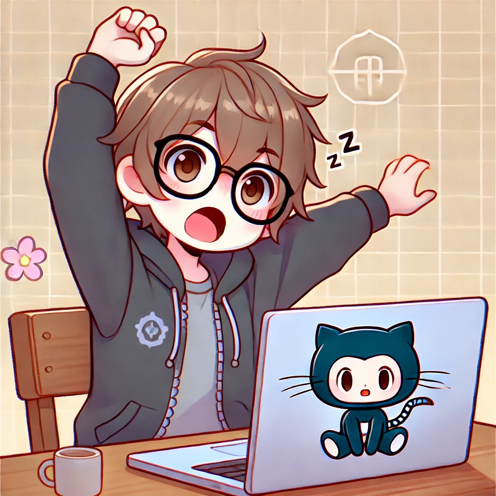

# Olá, mundo! Eu sou o Sidy!!!

  
  
 
    Borges Costta, 26 anos, é um estudante de Ciência da Computação apaixonado por design, desenvolvimento front-end e criação de interfaces intuitivas e funcionais. Com uma base sólida em programação e um olhar        apurado para estética, Borges combina habilidades técnicas e criativas para oferecer experiências digitais de alta qualidade. Seu histórico em desenvolvimento de jogos o ensinou a trabalhar com lógica, 
    resolução de problemas e design de interação, habilidades que agora aplica no mundo do front-end. 🚀 
  

  
  ## Habilidades Técnicas
  - 🎨 HTML, CSS e JavaScript: Borges domina as bases do desenvolvimento web, utilizando-as para criar páginas elegantes e responsivas. Ele se especializa em garantir que os designs sejam tanto visualmente atraentes    quanto funcionais.
  - 🖌️ UI/UX Design: Apaixonado por design, Borges utiliza ferramentas como Figma para prototipar e criar designs centrados no usuário.
  - 🆚 Git & GitHub: Experiente em controle de versão, ele organiza seus projetos e colabora eficientemente com outros desenvolvedores.
  ## Hobbies e Interesses
  - 🎧 Música: Em seu tempo livre, Borges relaxa tocando violão e ouvindo música, uma fonte constante de inspiração para seu lado criativo.
  - 🎨 Criação Visual: Ele gosta de explorar novas ideias em design gráfico e ilustração, habilidades que complementam sua expertise em front-end.
  - 💻 Exploração Tecnológica: Focado em inovação, Borges busca constantemente aprender novas ferramentas e tendências em tecnologia para se manter atualizado no mercado.
  ## Motivações
  Borges é movido pelo desejo de criar interfaces que conectem pessoas e tecnologia de maneira fluida e intuitiva. Ele se desafia a transformar ideias em experiências digitais impactantes, equilibrando design e       funcionalidade. Com ambição de se tornar um especialista em front-end, Borges sonha em contribuir para projetos inovadores e ajudar a construir um futuro digital mais inclusivo e interativo.

